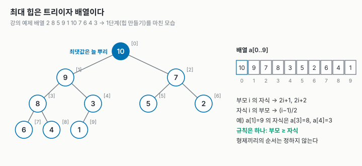
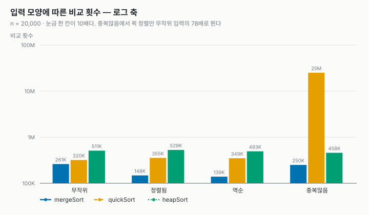
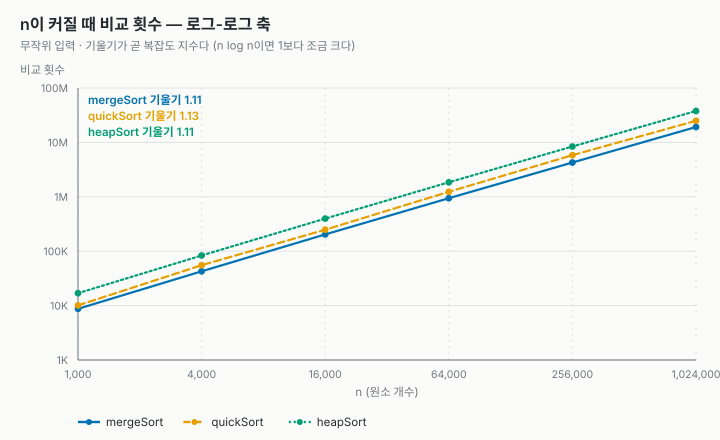
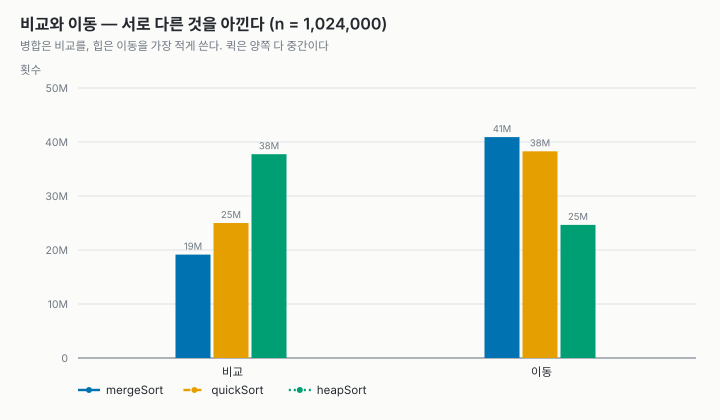
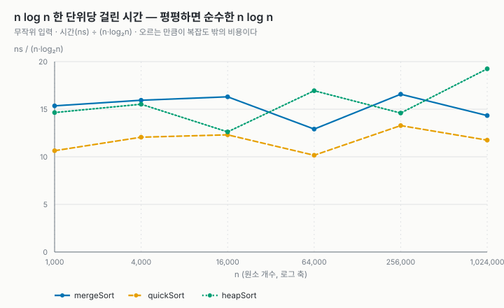
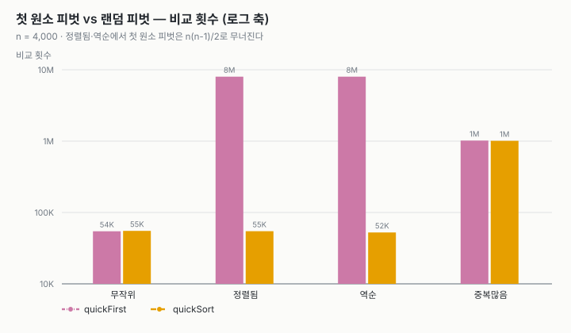
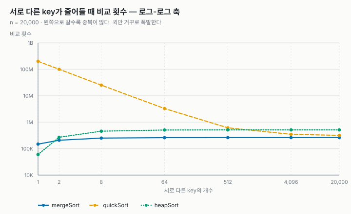

# 정렬 비교 보고서 — 병합 · 퀵 · 힙

| 항목 | 내용 |
| --- | --- |
| 과목 | 2026-2 고급알고리즘 과제 1 |
| 이름 · 학번 | (이름) · (학번) |
| 저장소 | `https://github.com/<계정>/<저장소>` |
| 실행 | `make test` (유닛 테스트 67개) · `make run` (비교 표) · `make charts` (그래프) |
| 환경 | 컨테이너 안 `gcc -std=c17 -Wall -Wextra -O2` |

비교한 정렬은 셋이다. 수업에서 배운 **병합 정렬**(주제 03)과 **퀵 정렬**(주제 04),
그리고 배우지 않은 **힙 정렬**이다. 강의 04의 "병합과 나란히" 표가 남긴 질문에서
출발했다.

> 병합은 **공간**(temp 배열)을 내주고, 퀵은 **최악의 경우**(O(n²))를 내줬다.
> 힙 정렬은 최악 O(n log n)이면서 추가 공간도 O(1)이다. 그럼 힙은 **무엇을** 내줬을까?

### 한눈에 보는 결과

| | 병합 | 퀵 (랜덤 피벗) | 힙 |
| --- | --- | --- | --- |
| 최악 시간 | O(n log n) | O(n²) | O(n log n) |
| 추가 메모리 (n = 1,024,000, 실측) | **8,192,008 B** | 8 B + 스택 깊이 47 | **8 B**, 재귀 없음 |
| 안정성 (실측) | 안정 | 불안정 | 불안정 |
| 비교 횟수 (n = 1,024,000) | **19.2M** (가장 적음) | 25.0M | 37.7M (가장 많음) |
| 이동 횟수 (n = 1,024,000) | 40.9M (가장 많음) | 38.3M | **24.7M** (가장 적음) |
| 걸린 시간 (n = 1,024,000) | 293 ms | **240 ms** | 393 ms |
| 약점으로 드러난 입력 | 없음 | **중복이 많은 입력** (비교 78배) | 큰 n (캐시) |

1. **힙이 내준 것은 안정성과 비교 횟수다.** 비교를 병합의 약 2배 쓴다. 대신
   이동은 셋 중 가장 적고 메모리는 원소 한 칸뿐이다.
2. **랜덤 피벗은 "정렬된 입력"이라는 최악을 없앤다.** n = 4,000 정렬된 입력에서
   비교가 7,998,000회에서 54,622회로 줄었다(146분의 1).
3. **그러나 랜덤 피벗도 "중복"이라는 최악은 못 막는다.** key가 8종류뿐이면 퀵의
   비교가 25,065,288회로, 무작위 입력(319,817회)의 78배가 된다. 예상하지 못한 발견이다.

---

## 1. 코드 보고서

### 1.1 구조 — 샘플의 인터페이스 위에 세 정렬을 올렸다

교수님 샘플 저장소(`hw1-sample-2026`)의 **공통 인터페이스와 측정 도구를 그대로
가져왔다**. 정렬은 함수 포인터를 담은 구조체(`SortAlgorithm`) 하나로 표현되고,
부르는 쪽(`main.c`, `bench.c`, 테스트)은 구현 표만 훑는다. 정렬을 바꾸는 일은
파일을 갈아 끼우고 표를 고치는 것으로 끝났다.

```c
/* src/sort.c */
const SortAlgorithm SORT_ALGORITHMS[] = {        /* 비교 대상 셋 */
    {"mergeSort", "O(n log n)", "O(n)",     1, mergeSort},
    {"quickSort", "O(n log n)", "O(log n)", 0, quickSort},
    {"heapSort",  "O(n log n)", "O(1)",     0, heapSort},
};
const SortAlgorithm SORT_VARIANTS[] = {          /* 실험 3에서만 쓰는 변형 */
    {"quickFirst", "O(n log n)", "O(log n)", 0, quickSortFirstPivot},
};
```

샘플과 달리 **표를 둘로 나눴다.** 강의 그대로 첫 원소를 피벗으로 쓰는 퀵 정렬은
피벗 실험에만 필요하고, 비교 대상 셋에 끼면 모든 표가 네 줄이 된다. 테스트는 두
표를 모두 훑으므로, 실험에만 쓰는 변형도 같은 검사를 받는다.

| 파일 | 맡은 것 | 샘플에서 |
| --- | --- | --- |
| `sort.h` · `sortctx.h` · `sort.c` | 인터페이스, 공통 도구(교환·이동·비교 세기), 구현 표 | 표와 `sortNoteDepth`만 고침 |
| `mergeSort.c` · `quickSort.c` · `heapSort.c` | 알고리즘 하나씩 | **새로 씀** |
| `bench.c` | 시간 · 안정성 측정 | 최솟값 측정, 안정성 판정 불가(-1) 추가 |
| `main.c` | 실험 네 개의 표와 CSV (`--csv`, `--pivot`, `--dups`) | 실험 3·4 추가 |
| `tools/plot.py` · `tools/heapfig.py` | CSV로 그래프(SVG)를 그린다. 표준 모듈만 쓴다 | 그래프 종류를 바꿈 |

`sortSwap`은 **자기 자신과의 교환을 세지 않게** 고쳤다. 퀵 정렬의 파티션은
`i == j`인 교환을 자주 부르는데, 이것은 아무것도 옮기지 않는다. 이렇게 해야 강의의
이동 횟수와 맞는다(1.2).

### 1.2 검증

```console
$ make test
...
67 checks, 0 failures
```

정렬 네 개(비교 대상 셋 + 변형 하나)마다 같은 검사 12개를 돌리고(48개), 전체를
대상으로 한 검사 19개를 더 돌린다.

| 검사 | 내용 |
| --- | --- |
| 기본 케이스 | 섞임 · 정렬됨 · 역순 · 중복 · 모두 같은 값 · 원소 1개 · 빈 배열 |
| `qsort` 대조 · 크기 훑기 | 난수 500개를 표준 라이브러리와 맞춘다. `n = 0..200`을 전부 돈다 |
| 안정성 | `tag` 순서 실측이 구현 표의 `stable` 값과 **일치**하는지 (불안정이라 적었으면 실제로 깨져야 한다) |
| **강의 숫자 재현** | 주제 03 · 04 슬라이드의 비교·이동 횟수 7개를 그대로 내는지 (아래 표) |
| 주장 확인 | 랜덤 피벗이 정렬된 입력의 최악을 피하는지, 시드 고정으로 재현되는지, 힙이 원소 한 칸만 쓰는지 |

**강의와 같은 규칙으로 센다는 것을 먼저 확인했다.** 세는 규칙이 다르면 강의와
견줄 수 없기 때문이다. 강의 예제 배열 `2 8 5 9 1 10 7 6 4 3`에서 일곱 숫자가 모두
일치한다.

| 슬라이드 | 입력 | 강의 (비교 / 이동) | 이 구현 |
| --- | --- | --- | --- |
| 주제 03 병합 | 예제 · 정렬됨 · 역순 | 22/68 · 19/68 · 15/68 | 같음 |
| 주제 04 퀵 (첫 원소 피벗) | 최선 · 예제 · 정렬됨 · 역순 | 19/9 · 25/21 · 45/0 · 45/15 | 같음 |
| (참고) 힙 | 예제 | — | 40 / 73 |

**테스트가 실제로 잡는지도 확인했다(변이 테스트).** 코드를 일부러 망가뜨려 본다.

| 망가뜨린 곳 | 결과 |
| --- | --- |
| 병합의 `<=` → `<` | 검사 **3개** 실패. 전부 안정성 검사다. 결과는 여전히 정렬되어 있다 |
| 힙에서 "두 자식 중 큰 쪽 고르기" 삭제 | 7개 실패 (정렬이 틀린다) |
| 힙 만들기를 위(0)에서 아래로 | 5개 실패. 아래에서 위로 가야 하는 이유가 테스트로 드러난다 |
| 퀵의 랜덤 피벗 끔 | 1개 실패: "랜덤 피벗은 첫 원소 피벗의 1/10 미만" |
| 퀵의 시드 되돌리기 삭제 | 1개 실패: "두 번 돌려도 측정값이 같다" |

그 밖에 **ASan · UBSan**을 붙여 테스트를 돌려 경고가 없음을 확인했다.

---

## 2. 알고리즘 상세

### 2.1 병합 정렬 — 합치는 데서 일한다

가운데를 잘라 양쪽을 재귀로 정렬하고, 돌아오는 길에 `merge`로 합친다. 강의 코드
(`01_merge_sort`)와 같은 모양이다. 두 가지만 짚는다.

- **`<=`가 안정성이다.** 같은 값이면 왼쪽 것을 먼저 내보낸다. 이것을 `<`로 바꾸면
  정렬은 되는데 안정성만 깨진다(1.2의 변이 테스트).
- **이동 횟수는 입력과 무관하다.** 구간 전체가 매번 temp로 갔다가 돌아온다. 그래서
  n = 20,000에서 네 입력 모두 이동이 **574,464회로 똑같다**(3.2).

temp는 정렬 시작에 한 번만 `n`칸을 잡아 재귀 전체가 나눠 쓴다. 이 `n`칸이 병합이
치르는 값이다.

### 2.2 퀵 정렬 — 나누는 데서 일한다

파티션은 강의 코드(`02_quick_sort`)와 같다. 피벗을 `a[lo]`에 두고 그보다 **작은**
것을 왼쪽으로 모은 뒤, 피벗을 경계로 옮긴다. 달라진 것은 파티션 **앞의 두 줄**이다.

```c
/* src/quickSort.c */
size_t pick = lo + (size_t)(nextRandom() % (int64_t)(hi - lo + 1));
if (pick != lo) {
    sortSwap(c, lo, pick);   /* 아무 자리나 골라 맨 앞으로. 파티션은 그대로다 */
}
```

난수는 라이브러리 `rand()` 대신 **주제 04에서 만든 minstd 생성기**
(`state = state * 16807 % 2147483647`)를 썼다. 정렬을 부를 때마다 시드를 1로
되돌리므로, 랜덤 피벗인데도 같은 입력이면 비교·이동 횟수가 매번 같다. 강의에서
배운 "시드가 같으면 수열이 같다"를 측정의 재현성에 쓴 것이다.

**불안정한 이유**는 피벗을 경계로 옮기는 마지막 교환이다. 첫 원소 피벗으로
`(2,가) (1,나) (1,다)`를 정렬하면 `(1,다) (1,나) (2,가)`가 된다. 피벗 `2`가 맨 뒤의
`(1,다)`와 자리를 바꾸면서 `다`가 `나`를 뛰어넘는다.

### 2.3 힙 정렬 — AI와 함께 학습한 과정

힙 정렬은 수업에서 다루지 않았다. Wikipedia의 비교표에서 골랐고, AI(Claude)에게
질문하며 배웠다. 질문과 답을 요약하고, 이해한 것을 코드와 실험으로 확인했다.

**Q1. 힙이 뭔가? 트리라면서 왜 배열에 저장하나?**
힙은 "부모가 자식보다 작지 않다"는 규칙 **하나만** 지키는 완전 이진 트리다(최대 힙).
완전 이진 트리는 위에서부터 왼쪽부터 빈칸 없이 채우므로, 번호를 차례로 매기면
배열 인덱스와 딱 맞는다. 그래서 포인터가 필요 없다. 0부터 세면 부모 `i`의 자식은
`2i+1`, `2i+2`이고, 자식 `i`의 부모는 `(i-1)/2`다.



→ *내가 이해한 것:* 힙은 "정렬된 상태"가 아니다. 형제끼리의 순서는 정하지 않는다.
보장하는 것은 **최댓값이 뿌리 `a[0]`에 있다**는 것 하나뿐이다. 그런데 정렬에는 그
하나로 충분하다.

**Q2. 그 성질로 어떻게 정렬하나?**
두 단계다. ① 배열 전체를 힙으로 만든다. ② 뿌리(최댓값)를 배열 맨 뒤와 바꾸고,
힙을 한 칸 줄인 뒤, 새 뿌리를 제자리로 내려보낸다(`siftDown`). 이것을 n-1번 하면
뒤쪽부터 큰 값이 차례로 쌓인다. 선택 정렬(주제 02)이 "남은 것 중 최댓값을 찾아
뒤로 보내는" 것과 같은 뼈대인데, 최댓값을 찾는 데 O(n)이 아니라 **O(log n)**이
든다는 점만 다르다.

강의 예제 배열로 직접 따라가 보았다(`tools/heapfig.py`와 같은 결과).

| 단계 | 배열 (`|` 뒤는 자리가 확정된 부분) |
| --- | --- |
| 시작 | `2 8 5 9 1 10 7 6 4 3` |
| ① 힙 만들기 끝 (비교 13 · 이동 15) | `10 9 7 8 3 5 2 6 4 1` |
| ② 10을 뒤로 보내고 내려보내기 | `9 8 7 6 3 5 2 1 4 | 10` |
| ② 9를 뒤로 | `8 6 7 4 3 5 2 1 | 9 10` |
| … 7번 더 | `1 | 2 3 4 5 6 7 8 9 10` (전체 비교 40 · 이동 73) |

**Q3. 힙 만들기는 왜 아래에서 위로 가나? 그러면 왜 O(n)인가?**
`siftDown`은 "아래쪽 두 부분 트리가 이미 힙"이어야 제대로 동작한다. 그래서 자식이
있는 마지막 부모(`n/2 - 1`)부터 뿌리 쪽으로 거꾸로 간다. 비용은 원소마다 내려갈
높이만큼인데, 원소의 절반은 잎이라 0칸, 4분의 1은 1칸, 8분의 1은 2칸, …이다.
대부분이 거의 안 내려가므로 높이의 합이 n을 넘지 않는다. 강의 예제에서도 힙 만들기는
비교 13회로 끝났고, 나머지 27회는 ② 단계에서 썼다. 실제로 1.2의 변이 테스트에서 방향을 뒤집자
정렬이 틀렸다.

**Q4. 왜 불안정한가?**
② 단계의 "뿌리와 맨 뒤를 바꾸기"가 멀리 떨어진 원소를 맞바꾸기 때문이다. 가장
작은 예로 `(5,가) (5,나)` 두 개를 정렬하면 `(5,나) (5,가)`가 된다. 이미 힙이므로
① 단계에서는 아무 일도 없고, ② 단계에서 뿌리 `(5,가)`가 맨 뒤로 가 버린다.
**같은 값 두 개만으로 깨진다.** 이 코드로 직접 돌려 확인했다.

**Q5. 최악도 O(n log n), 메모리도 O(1)이면 왜 실전에서는 퀵을 더 쓰나?**
AI의 답은 두 가지였다. 비교 횟수가 많다(약 2n log₂n으로 병합의 2배), 그리고
**캐시**에 불리하다. `siftDown`은 `i`에서 `2i+1`로 뛴다. 트리 아래로 갈수록 이웃한
원소가 메모리에서 멀리 떨어져, 큰 배열에서는 캐시 미스가 난다. 반면 퀵의 파티션과
병합은 배열을 앞에서 뒤로 차례로 읽는다.
→ *이 답은 실험으로 확인하기로 했다.* 결과는 3.3에 있다. 비교 횟수는 예측대로였고,
캐시 효과는 n이 백만 개가 되어서야 드러났다.

**내 구현에서 한 선택: 교환 대신 "구멍 내리기".**
`siftDown`을 교환으로 짜면 한 층 내려갈 때마다 이동이 3번이다. 대신 내려갈 원소를
`tmp`에 들고, 더 큰 자식을 한 칸씩 끌어올린 뒤, 마지막 빈자리에 한 번 놓았다.
삽입 정렬이 원소를 미는 것과 같은 수다. 한 층에 이동 1번이라 이동이 3분의 1로 준다.

```c
/* src/heapSort.c — siftDown의 핵심 */
if (child + 1 < end && sortCompareAt(c, child, child + 1) < 0) {
    child++;                                   /* 두 자식 중 큰 쪽 */
}
if (sortCompareTmp(c, child) <= 0) {
    break;                                     /* 들고 있는 원소가 더 크면 여기가 제자리 */
}
sortMove(c, sortElemAt(c, hole), sortElemAt(c, child));   /* 자식을 끌어올린다 */
hole = child;
```

---

## 3. 알고리즘 실험

### 3.1 무엇을 어떻게 쟀나

| 재는 것 | 방법 |
| --- | --- |
| 비교 · 이동 | 구현이 `SortStats`에 센다. 입력이 고정이라 **언제 돌려도 같은 값**이다 |
| 시간 | `clock()`, 복사를 뺀 구간. **여러 번 돌린 중 최솟값** |
| 메모리 · 재귀 깊이 | `extraBytes`(입력 밖에 잡은 최대 바이트), `maxDepth`(스택의 대리 지표) |
| 안정성 | `(key, tag)` 원소로 실측. 같은 key가 하나도 없으면 `-`(판정 불가) |

샘플은 시간의 **평균**을 냈는데, 이 컨테이너에서는 같은 측정을 다시 돌리자 평균이
20% 넘게 달라졌다(힙, n = 256,000에서 78ms와 102ms). 같은 입력·같은 코드에서 느려진
회차는 알고리즘이 아니라 다른 프로세스 탓이므로 **최솟값**으로 바꿨고, 실행 간 차이가
10% 안팎으로 줄었다.

**안정성 판정 불가(`-`)는 이번에 추가했다.** 무작위 입력은 key가 `rand()` 값이라
같은 key가 거의 없다. 그러면 어떤 정렬이든 "안정"으로 나온다. 처음 측정에서 힙과
퀵이 무작위 입력에서 "안정"으로 찍혔는데, 그것은 안정하다는 증거가 아니라 판정할
거리가 없었다는 뜻이었다. 그래서 같은 key가 없으면 `-`로 표시한다.

모든 숫자는 한 번의 `make charts` 실행에서 나왔고 원본은 `report/results.csv`,
`pivot.csv`, `dups.csv`에 있다.

### 3.2 실험 1 — 입력 모양별 (n = 20,000)

| 입력 | 알고리즘 | 시간(ms) | 비교 | 이동 | 추가 메모리 | 재귀깊이 | 안정성 |
| --- | --- | ---: | ---: | ---: | ---: | ---: | :---: |
| 무작위 | mergeSort | 6.122 | **260,891** | 574,464 | 160,008 B | 16 | - |
| | quickSort | **4.533** | 319,817 | 472,386 | 8 B | 31 | - |
| | heapSort | 5.810 | 510,783 | **368,374** | 8 B | 1 | - |
| 정렬됨 | mergeSort | 4.107 | **148,016** | 574,464 | 160,008 B | 16 | - |
| | quickSort | **1.976** | 354,792 | **60,090** | 8 B | 34 | - |
| | heapSort | 4.823 | 529,074 | 382,874 | 8 B | 1 | - |
| 역순 | mergeSort | 2.185 | **139,216** | 574,464 | 160,008 B | 16 | - |
| | quickSort | **1.802** | 349,347 | 405,954 | 8 B | 35 | - |
| | heapSort | 3.032 | 493,307 | **354,330** | 8 B | 1 | - |
| 중복많음 | mergeSort | **2.856** | **250,138** | 574,464 | 160,008 B | 16 | 안정 |
| | quickSort | 37.065 | 25,065,288 | **195,042** | 8 B | **2,598** | 불안정 |
| | heapSort | 3.510 | 457,930 | 335,313 | 8 B | 1 | 불안정 |



- **셋의 성격이 입력마다 다르게 드러난다.** 병합은 이동이 네 입력 모두 574,464회로
  같고, 정렬됨·역순에서 비교가 절반으로 준다(한쪽이 먼저 바닥나기 때문). 힙은 입력을
  거의 타지 않는다. 비교 457K~529K 사이다.
- **랜덤 피벗 덕분에 퀵은 정렬됨·역순에서도 멀쩡하다.** 오히려 정렬됨에서 가장
  빠르다(1.976ms). 파티션이 원소를 거의 옮기지 않기 때문이다(이동 60,090회).
- **중복많음(key 8종류)에서 퀵만 무너진다.** 비교가 무작위의 78배, 재귀 깊이가
  2,598이다. 3.5에서 따로 파고든다.
- 안정성 열은 **중복많음에서만** 값이 나온다. 거기서 병합은 안정, 퀵·힙은 불안정으로,
  구현 표의 주장과 일치했다.

### 3.3 실험 2 — n을 키우며 (무작위 입력)

| n | merge 비교 | quick 비교 | heap 비교 | merge ms | quick ms | heap ms |
| ---: | ---: | ---: | ---: | ---: | ---: | ---: |
| 1,000 | 8,720 | 10,104 | 16,886 | 0.153 | 0.106 | 0.146 |
| 16,000 | 203,227 | 248,767 | 397,650 | 3.643 | 2.750 | 2.819 |
| 64,000 | 941,144 | 1,234,986 | 1,846,254 | 13.192 | 10.380 | 17.312 |
| 256,000 | 4,276,468 | 5,824,707 | 8,409,572 | 76.242 | 61.062 | 67.130 |
| 1,024,000 | 19,154,394 | 24,995,595 | 37,736,149 | 293.065 | **240.253** | 393.415 |



- 로그-로그 축에서 셋 다 기울기 **1.11~1.13**의 직선이다. n log n은 이 구간에서
  기울기가 1.1 남짓이다. 셋 다 O(n log n)임을 축에서 읽는다.
- 기울기는 같고 **높이가 다르다.** 비교 횟수를 `n log₂n`으로 나누면 n = 1,024,000에서
  병합 **0.94**, 퀵 **1.22**, 힙 **1.85**다. 교과서의 상수(병합 약 1, 랜덤 퀵 약 1.39,
  힙 약 2)에 가깝다. **힙은 병합보다 비교를 2배 쓴다** — Q5의 첫 번째 답이 맞았다.



- 그런데 **이동은 순서가 정반대다.** 힙이 가장 적고(24.7M), 병합이 가장 많다(40.9M).
  병합은 temp로 갔다가 돌아오느라 한 레벨에 2n번 옮긴다. 힙은 구멍 내리기(2.3) 덕분에
  한 층에 1번이다. **셋은 서로 다른 것을 아낀다.**



- 시간을 `n·log₂n`으로 나누면, 순수한 n log n은 평평한 선이 된다. 퀵은 끝까지
  10.2~13.3ns로 가장 낮다. 병합과 힙은 n = 256,000까지 12.6~16.9ns에서 엎치락뒤치락한다.
- **힙만 n = 1,024,000에서 19.2ns로 뛴다.** 배열이 8 MB가 되어 캐시를 넘치는 지점이다.
  비교 횟수의 비율(힙/병합 = 1.97)은 n이 커져도 거의 그대로인데 시간 비율은 1.34배로
  벌어진다. 늘어난 몫은 비교가 아니라 **메모리 접근**에서 왔다 — Q5의 두 번째 답
  (캐시)과 맞는 방향이다. 다만 이 그래프는 회차마다 몇 ns씩 흔들린다. 캐시 효과를
  단정하려면 더 큰 n과 반복이 필요하다(한계 참고).

### 3.4 실험 3 — 첫 원소 피벗 vs 랜덤 피벗 (n = 4,000)

| 입력 | 첫 원소 피벗 비교 | 재귀깊이 | 랜덤 피벗 비교 | 재귀깊이 |
| --- | ---: | ---: | ---: | ---: |
| 무작위 | 54,492 | 25 | 55,268 | 30 |
| 정렬됨 | **7,998,000** | **4,000** | 54,622 | 27 |
| 역순 | **7,998,000** | **4,000** | 52,418 | 26 |
| 중복많음 | 1,017,335 | 529 | 1,009,386 | 528 |



- 정렬됨 · 역순에서 첫 원소 피벗은 정확히 `n(n-1)/2 = 7,998,000`회를 비교한다.
  강의의 45회(n = 10)가 n = 4,000에서 그대로 재현된다. 재귀 깊이도 n과 같은 4,000이다
  — 트리가 외길이 되었다는 뜻이다.
- 랜덤 피벗은 네 입력 중 세 입력에서 **무작위 입력과 같은 수준**(52K~55K)이 된다.
  강의의 표현대로 최악이 "특정 입력"에서 "입력과 난수의 조합"으로 바뀌었다.
- **마지막 묶음이 이상하다.** 중복많음에서는 두 피벗이 똑같이 100만 회다. 랜덤 피벗이
  효과가 없다.

### 3.5 실험 4 — 중복이 많아지면 (n = 20,000)

실험 3의 이상한 묶음을 파고들었다. 서로 다른 key의 개수를 20,000개에서 1개까지 줄여 가며 잰다.



| 서로 다른 key | merge 비교 | quick 비교 | heap 비교 | quick 재귀깊이 |
| ---: | ---: | ---: | ---: | ---: |
| 20,000 | 260,875 | 317,983 | 510,883 | 30 |
| 512 | 260,846 | 612,690 | 510,624 | 70 |
| 64 | 260,057 | 3,278,769 | 506,187 | 356 |
| 8 | 250,138 | 25,065,288 | 457,930 | 2,598 |
| 1 (모두 같은 값) | 148,016 | **199,990,000** | **59,994** | **20,000** |

- 모두 같은 값이면 퀵의 비교는 정확히 `n(n-1)/2 = 199,990,000`이다. **피벗을 어떻게
  골라도 최악이다.**
- 원인은 파티션이 피벗보다 **작은** 것만 왼쪽으로 보낸다는 데 있다. 피벗과 **같은**
  값은 전부 오른쪽에 남는다. 모두 같은 값이면 왼쪽이 매번 비고 오른쪽이 한 칸씩만
  준다 — 정렬된 입력에서 첫 원소 피벗이 무너진 것과 똑같은 외길 트리다. key가 k종류면
  같은 값 덩어리 k개가 각각 `(n/k)²/2`를 치르고, k = 8에서 `8 × 2,500²/2 ≈ 25M`으로
  측정값과 맞는다.
- 랜덤 피벗은 **피벗의 값**을 바꿀 뿐, "같은 값을 어디로 보내나"는 바꾸지 못한다.
  그래서 효과가 없다. 해결책은 피벗과 같은 값을 가운데 따로 모으는 **3-way
  파티션**이다(한계 참고).
- 반대로 **힙은 중복이 많을수록 빨라진다.** 모두 같은 값이면 `siftDown`이 첫 비교에서
  바로 멈춰 비교가 약 3n(59,994)으로 떨어진다. 병합은 거의 영향을 받지 않는다.

---

## 4. 결론 — 각 정렬이 내준 것

| | 얻은 것 | 내준 것 (실측 근거) |
| --- | --- | --- |
| 병합 | 가장 적은 비교, 입력을 타지 않는 성능, **안정성** | 추가 메모리 n칸 (8,192,008 B), 가장 많은 이동 |
| 퀵 (랜덤 피벗) | 무작위 입력의 모든 크기에서 **가장 빠른 시간**, temp 없음 | 안정성, 중복 입력에서 O(n²) (비교 78배~) |
| 힙 | 최악 O(n log n) **그리고** 추가 메모리 8 B, 재귀 없음, 가장 적은 이동 | 안정성, **2배의 비교**, 큰 n에서 캐시 손해 |

처음 질문 "힙은 무엇을 내줬나"의 답은 **안정성과 상수**다. 복잡도 표에서는 셋이
모두 O(n log n)으로 같은 줄에 서지만, 실제로 재 보니 상수(비교 횟수 0.94 : 1.22 : 1.85)와
메모리 접근 방식이 순위를 갈랐다.

그리고 **"최악을 피했다"는 말에는 어떤 최악인지가 붙어야 한다**는 것을 배웠다. 랜덤
피벗은 강의가 말한 최악(정렬된 입력)을 정확히 없앴지만, 중복이라는 다른 최악은
그대로 두었다. 이것은 복잡도 표에도 강의에도 없던 것이고, 입력 모양을 바꿔 가며
재 보지 않았다면 몰랐을 것이다.

### 한계

- **3-way 파티션을 구현하지 않았다.** 실험 4의 문제를 확인만 하고 고치지는 않았다.
  넣으면 중복많음의 퀵이 병합 수준으로 돌아올 것으로 예상한다.
- **캐시 효과는 방향만 확인했다.** 시간 측정이 공유 컨테이너에서 10% 안팎 흔들리고, n은
  1,024,000까지만 쟀다. 하드웨어 카운터(`perf`)로 캐시 미스를 직접 재지 않았다.
- **스택은 추가 메모리에 세지 않았다.** 퀵의 재귀 깊이는 중복 입력에서 20,000까지
  간다. 짧은 쪽만 재귀하고 긴 쪽은 반복문으로 돌리면 O(log n)으로 묶을 수 있다.
- 입력의 무작위성은 `rand()`에, 피벗의 무작위성은 minstd에 맡겼다.

### AI 활용 내역

- 힙 정렬 학습(2.3)은 AI(Claude)와의 질의응답으로 했다. 질문과 답의 요약, 그리고 내가
  이해한 것을 구분해 적었다.
- 코드 작성과 보고서 초안에도 AI의 도움을 받았다. 모든 수치는 직접 실행해 얻은
  CSV에서 옮겼고, 강의 숫자 재현 테스트로 세는 규칙을 검증했다.
